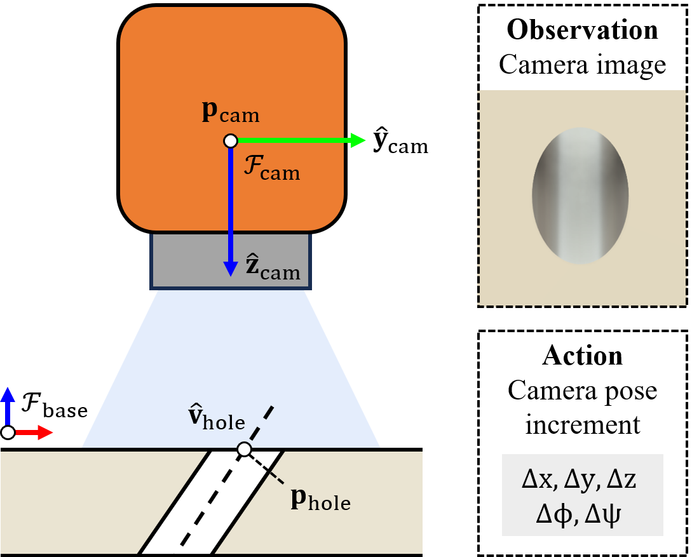
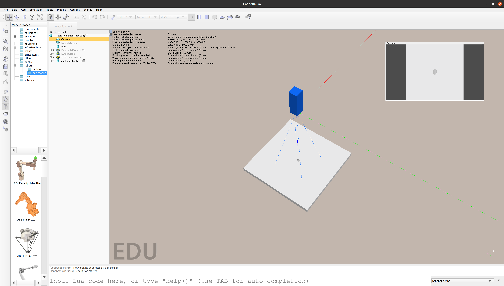
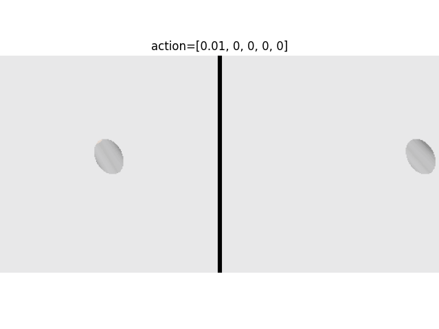
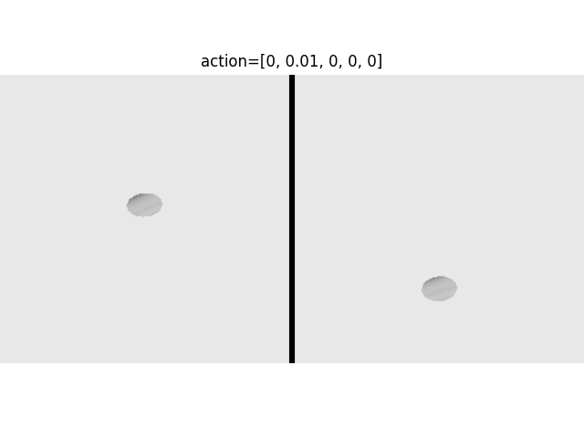
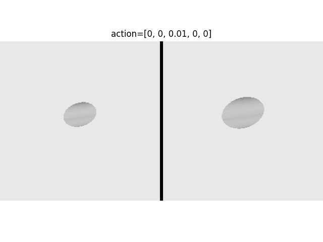
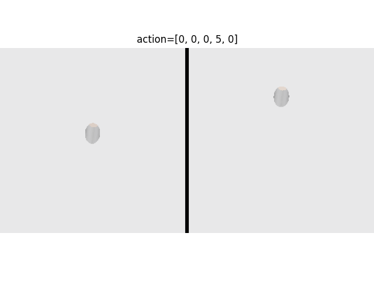
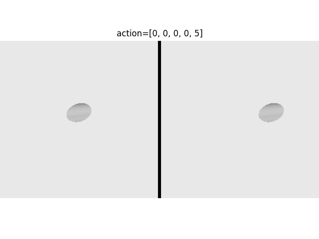

# ELEG5491 Course Project

## Overview

## Simulation Environment

**Note**: the x (red) and y (green) axes of the camera frame are opposite to the image coordinate frame.

### Initialization test
The camera is initialized to random poses while maintaining the hole in the center of the image.

### Action test

## Training Result

[Training report on W&B](https://api.wandb.ai/links/yanma233/0p2pyliu)
